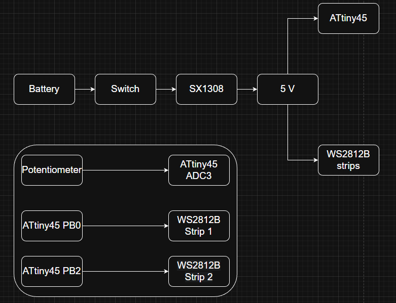
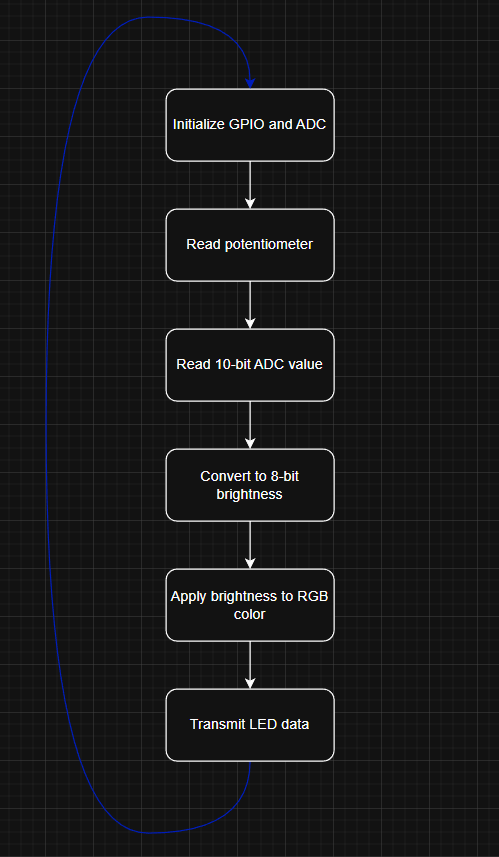

# Scooter LED Controller

# Overview
The Scooter LED Controller is a personal embedded-systems project designed to control a 30-LED WS2812B lighting system installed on the deck of a scooter.

The project is primarily a learning and engineering project rather than a solution to a specific real-world problem. It was built to gain practical experience with AVR microcontrollers, ADCs, timing-critical communication, and low-level firmware development.

The controller is based on the ATtiny45 microcontroller and allows the user to turn the LEDs on or off and adjust their brightness using a potentiometer. The WS2812B communication is implemented directly using AVR instructions and inline assembly rather than relying on a high-level LED library. This approach was chosen to both keep the firmware lightweight for the ATtiny45's limited memory and to provide precise control over the timing required by the WS2812B protocol.

# Features
- 30 x WS2812B LEDs arranged as two 15-LED strips
- Two independent WS2812B data lines
- Potentiometer-controlled brightness
- 10-bit ADC input mapped to an 8-bit brightness value
- Direct AVR register manipulation
- Custom WS2812B communication using inline AVR assembly
- Solid-color LED output in the current firmware
  
# Hardware
### Microcontroller
The controller is built around an ATtiny45-20PU microcontroller in an 8-pin PDIP package.

The ATtiny45 provides the GPIO, ADC, and processing resources required by the project while keeping the controller small and simple. The firmware uses the microcontroller's hardware peripherals and directly accesses AVR registers for GPIO and ADC configuration.

ATtiny45 specifications: 
- 4 KB flash 
- 256 B SRAM 
- 256 B EEPROM

### LED Configuration
The lighting system consists of two 0.5m WS2812B strips, each containing 15 LEDs at a density of 30 LEDs/m. The two strips are installed along the sides of the scooter deck, resulting in 30 LEDs in total.

The choice of 30 LEDs was based on the intended use of the system. Higher LED densities can make a significant visual difference when LED strips are viewed directly, such as in room lighting. However, for this project the LEDs are mounted underneath the scooter and are primarily intended to illuminate the ground while riding. Therefore, increasing the density beyond 30 LEDs/m would provide very small visual benefits while increasing power consumption and system complexity.

Each strip has its own dedicated data line from the ATtiny45. The current firmware sends the same solid color to both strips, but keeping the data lines independent leaves the system open to future improvements, like patterns, animations, or independent control of the two sides without requiring changes to the physical LED wiring.

### Brightness Control
LED brightness is controlled using a WH148 10 kΩ potentiometer connected to the ATtiny45's PB3 / ADC3 input.

The ATtiny45's 10-bit ADC converts the potentiometer position into a value from 0 to 1023. The firmware then maps this value to an 8-bit brightness value from 0 to 255 by shifting the ADC result right by two bits(equivalent of division by 4).

A brightness value of 0 results in LEDs being turned off. However, the potentiometer is intended primarily for brightness adjustment, as there is a separate physical switch used for turning the system power on or off.

# Power System
### Power Architecture
The system is powered by a 3.7V, 2100 mAh Li-ion battery. Since the WS2812B LEDs require a 5V supply, the SX1308 boost converter is used to increase the battery voltage to the required 5V.

The physical switch mentioned earlier is used to turn the system on and off, and it is placed between the battery and boost converter, while the 5V output from the boost converter supplies both the ATtiny45 and the WS2812B LED strips.

The battery is recharged using a dedicated USB Type-C Li-ion charging module with CC/CV charging and integrated battery protection. The charger supports a maximum charging current of 500 mA, so a full charge would take ~4 hours.

### Power Budget
Each WS2812B LED can draw up to approximately 60 mA at maximum brightness. With 30 LEDs, the theoretical maximum LED current is:
```
30 x 60mA = 1.8A
```

At the 5V LED supply, this corresponds to a theoretical maximum power consumption of:
```
5V * 1.8A = 9W
```

This represents the maximum LED load when all three RGB channels of all 30 LEDs are at full brightness. The actual power consumption of a real use is expected to be lower, since reaching the maximum would require all LEDs to display white at full brightness, which is not necessary for the intended underglow use.

The battery has a nominal energy capacity of:
```
3.7V * 2.1Ah = 7.77Wh
```

The battery provides approximately 3.7V nominally, while the LEDs require a regulated 5V supply. The SX1308 boost converter increases the battery voltage to 5V by transferring energy through a switching circuit.

This conversion is not 100% efficient. Some of the input energy is lost as heat and electrical losses in the converter's switching components, inductor, and other circuit elements. Therefore, the power available at the 5V output is lower than the power drawn from the battery, and the battery current is also higher than the current delivered to the LEDs. The relationship of the input and output power written down are:

P<sub>in</sub> > P<sub>out</sub>

and

V<sub>in</sub> × I<sub>in</sub> > V<sub>out</sub> × I<sub>out</sub>

### Charging
The Li-ion battery is charged using a dedicated USB Type-C charging module based on a CC/CV charging system. The module provides a maximum charging current of 500 mA and includes protection against short circuits, overvoltage, and undervoltage.

The charger connects directly to the battery through a JST connector and is separate from the boost-converter path used to power the system during operation.

# System Architecture
### Hardware Architecture

<p align="center">
  
</p>


The hardware is organized around the SX1308 boost converter, which generates the regulated 5V supply required by both the ATtiny45 and the WS2812B strips.

The 5V output of the SX1308 is split into two parallel power branches. One branch supplies the ATtiny45, while the other supplies the two WS2812B strips. This allows the microcontroller and LEDs to just share the same power supply while remaining in separate power branches.

The potentiometer is connected to the ATtiny45's ADC3 input and provides the analog input used for brightness control.

The Attiny45 controls the two WS2812B strips through separate data lines. PB0 is connected to the first strip, while PB2 is connected to the second strip. The two strips therefore have independent data connections, even though they share the same power supply.

### Firmware Architecture
The firmware is structured around a continous loop that reads the potentiometer, converts the ADC reading into a brightness value, and updates both WS2812B LED strips accordingly.

During initialization, the firmware configures the ATtiny45 GPIO pins and ADC. The ADC is configured to read the potentiometer connected to ADC3.

During normal use, the firmware repeatedly reads the 10-bit ADC value from the potentiometer. This value is converted from the ADC's 0-1023 range to an 8-bit brightness value from 0-255.

The brightness value is then applied to the configured RGB color before the resulting LED data is transmitted to both WS2812B strips. Each strip has its own data output, with PB0 controlling the first strip and PB2 controlling the second strip.

The main firmware flow can be summarized as:

<p align="center">
  
</p>

The WS2812B data transmission is implemented using direct AVR register manipulation and inline assembly to maintain the precise timing required by the protocol. The reason this level of timing precision is used becomes clearer in the Timing section, where the WS2812B protocol timing requirements are looked into with more detail.
